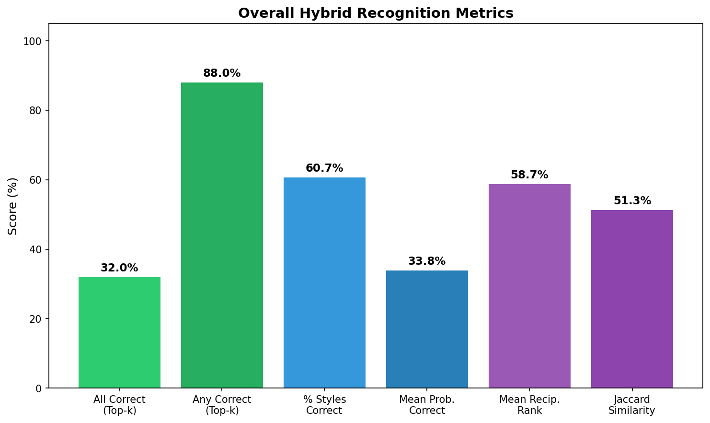
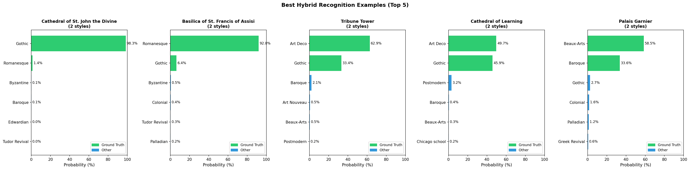
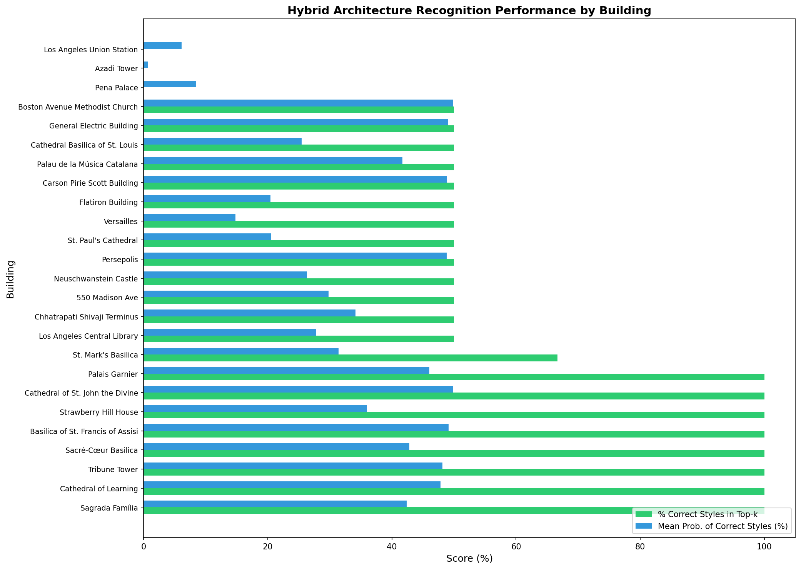
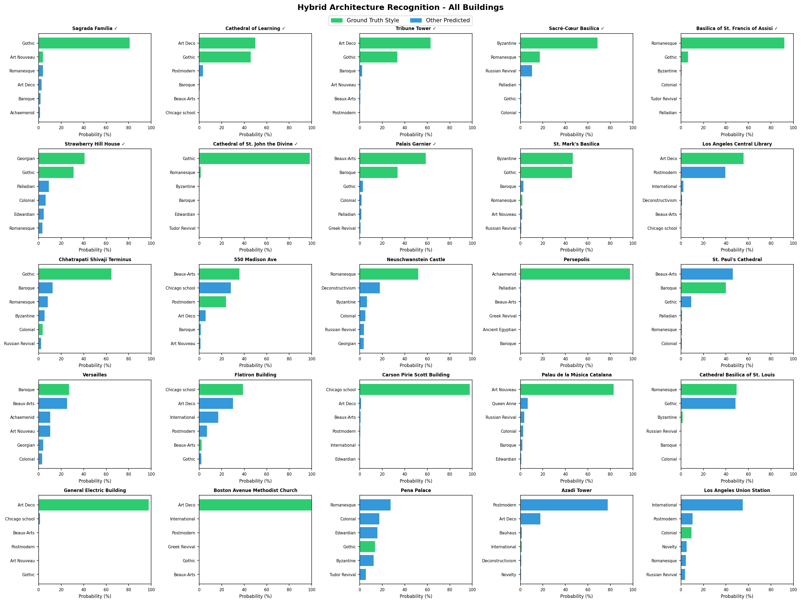
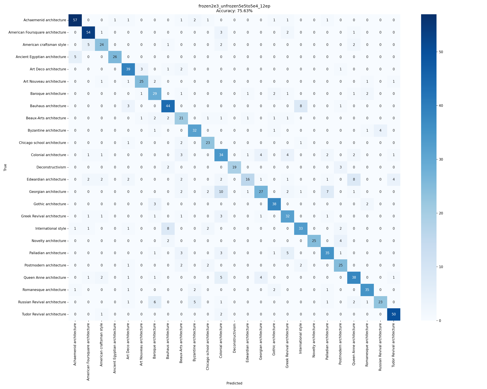
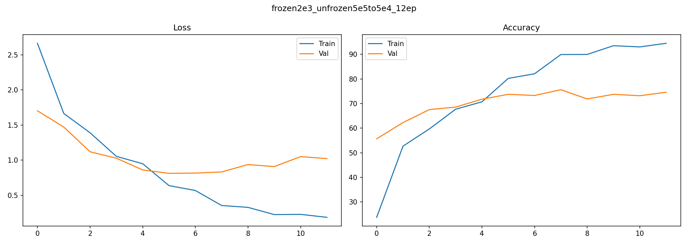

# Understanding Architectural Styles with Deep Learning

Classification of **25 architectural styles** using fine-tuned EfficientNetV2-L with gradual unfreezing, achieving state-of-the-art results on the [Xu et al. (2014) benchmark dataset](https://link.springer.com/chapter/10.1007/978-3-319-10590-1_39). 

Contribution of curated hybrid styles dataset enables novel evaluation framework for understanding complex spectrum of style labels associated with designs.

---

Architectural style is more than categorical labels. However, a reliable style classifier has many potential applications:

- **Architecture**: Applying a client's stylistic choices to select candidate prototype models
- **Urban planning**: Understanding the stylistic coherence of neighborhoods
- **Real estate**: Quantifying architectural character to study effects on property valuation
- **Heritage preservation**: Automated cataloging of buildings eligible for historic designation

But architectural style presents a uniquely challenging classification problem. Unlike objects with clear boundaries, **styles exist on a continuum**. Buildings often combine elements from multiple traditions such as a Gothic Revival church with Art Deco ornamentation, or a Beaux-Arts façade with Colonial proportions. Human experts frequently disagree on labels, and even the concept of "style" itself is contested among architectural historians (Hopkins, 2014).

This complexity makes architectural style an ideal testbed for understanding what deep learning models actually learn: **Do they memorize surface patterns, or do they develop meaningful representations of aesthetic principles?**

---

## 📊 Results

| Method | Year | Accuracy | Approach |
|--------|------|----------|----------|
| **EfficientNetV2-L (Ours)** | 2026 | **75.6%** | Fine-tuning with gradual unfreezing |
| ResNet50 baseline (Ours) | 2026 | 71.3% | Standard 2-stage fine-tuning |
| MobileNetV2 [[4]](#references) | 2019 | ~75% | MobileNetV2 feature extraction + deep learning |
| DPM-MLLR + Spatial Pyramid [[1]](#references) | 2014 | ~70% | feature engineering + latent variable approach |

### What the Numbers Miss

Raw accuracy tells only part of the story. Dua et al. [[4]](#references) found that a **trained architect achieved only 56% accuracy** on assigning style in a certain sample, highlighting that this task approaches the limits of human agreement. Many "errors" reflect genuine ambiguity: American Craftsman vs. American Foursquare, or International Style vs. Postmodern.

**Our unique contribution** is not just matching prior accuracy, but demonstrating through our **Hybrid Styles Evaluation** that the model has learned transferable style representations, not just memorized training examples.

---

## 🎯 Key Findings & Contributions

### 1. Gradual Unfreezing Outperforms Frozen Features

Prior work (Dua et al., 2019) used **frozen pretrained features** with learned classification heads. We show that **gradual unfreezing** or progressively training deeper layers is an effective approach.

| Training Strategy | Accuracy |
|-------------------|----------|
| Gradual unfreezing (ours) | 75.6% |
| Standard 2-stage fine-tuning | 73.5% |
| Frozen features + FC (Dua et al.) | ~75% |

Gradual unfreezing, inspired by ULMFiT [[3]](#references), allows the model to **adapt pretrained features to style-specific patterns** (pointed arches, flying buttresses, Doric columns) while preserving general visual understanding.

### 2. Foundation Model Scale Enables Small-Data Transfer

The Xu et al. dataset contains only ~5,000 images, small by modern standards. Yet we achieve strong results by leveraging **EfficientNetV2-L** (118M parameters pretrained on ImageNet).

**Key insight from ablations with InceptionNetv3, ResNet50, EfficientNetV2-S,M,L:** Better foundation models learn richer visual representations that transfer more effectively to specialized domains. Careful fine-tuning can somewhat compensate for limited domain-specific data. EfficientNetV2-L outperformed other models in early ablations.

### 3. Learning Rate Schedule is Critical

Our systematic series of sweeps revealed that these learning rates work best for this task:

| Config | Frozen LR | Unfrozen LR | Accuracy |
|--------|-----------|-------------|----------|
| Best | 2e-3 | 5e-5 → 5e-4 | **75.6%** |

Higher learning rates during the frozen phase enable rapid head convergence while aggressive unfrozen LRs allow meaningful backbone adaptation within limited epochs.

---

## 🏛️ Hybrid Architecture Evaluation: Probing Learned Representations

**Our key methodological contribution**: A novel evaluation framework that tests whether the model can recognize buildings combining **multiple architectural styles**.

### Why This Matters

Single-label classification hides a crucial question: **Has the model learned meaningful style representations, or just memorized surface patterns?**

Consider a Gothic Revival building with Art Deco elements. A memorization-based model might confidently predict one label. But a model with **genuine style understanding** should assign significant probability to both relevant styles.

Dua et al. [[4]](#references) recognized this challenge and proposed **object detection** to localize style-specific elements (windows, doors, ornaments). Our approach is complementary: we evaluate **probability distributions directly**, asking whether top-k predictions capture ground-truth styles.

### The Hybrid Style Buildings Dataset

We curated **25 culturally significant buildings** that architectural scholars explicitly document as fusing 2-3 styles:

| Building | Ground Truth Styles | Notes |
|----------|---------------------|-------|
| Cathedral of St. John the Divine | Romanesque + Gothic | Construction spanning style periods |
| Tribune Tower | Gothic + Art Deco | Chicago school eclecticism |
| Palais Garnier | Beaux-Arts + Baroque | Napoleon III's Paris Opera |
| Union Station (DC) | Beaux-Arts + Classical | Burnham's monumental design |

**Collection process:**
- Buildings selected from scholarly sources documenting architectural hybrids
- 2 distinct exterior photographs per building (50 total images)
- Human expert curation with AI-assisted (Deep Research) evidence gathering
- Non-watermarked, high-quality images only

See `hybrid_buildings/buildings.csv` for the full dataset with scholarly evidence.

### Evaluation Results

| Metric | Score | Interpretation |
|--------|-------|----------------|
| **All Correct (top-k)** | **32.0%** | All ground truth styles in top-k predictions |
| **Any Correct (top-k)** | **88.0%** | At least one correct style identified |
| **Mean % Styles Correct** | **60.7%** | Average fraction of styles captured |
| **Mean Probability (GT styles)** | **33.8%** | Probability mass on correct styles |
| **Mean Reciprocal Rank** | **58.6%** | How highly ranked are correct styles |
| **Jaccard Similarity** | **51.3%** | Set overlap (predicted ∩ actual) / (predicted ∪ actual) |

*Note: k = number of ground truth styles for each building (2 or 3)*


*Summary of evaluation metrics across all 25 hybrid buildings*

### Best-Performing Hybrid Style Buildings

**8 buildings (32%)** where the model correctly identified **all** component styles in top-k:

| Building | Styles | Mean Prob |
|----------|--------|-----------|
| Cathedral of St. John the Divine | Romanesque + Gothic | 49.9% |
| Basilica of St. Francis of Assisi | Romanesque + Gothic | 49.2% |
| Tribune Tower | Gothic + Art Deco | 48.1% |
| Cathedral of Learning | Gothic + Art Deco | 47.8% |
| Palais Garnier | Beaux-Arts + Baroque | 46.1% |
| Sacré-Cœur Basilica | Romanesque + Byzantine | 42.8% |
| Sagrada Família | Gothic + Art Nouveau | 42.3% |
| Strawberry Hill House | Georgian + Gothic | 36.0% |


*Top 5 hybrid buildings with detailed probability breakdowns showing model correctly identifies multiple styles*

### What These Results Reveal

1. **The model has learned compositional style features**, not just holistic templates. It can recognize Gothic elements (pointed arches, tracery) even when combined with Art Deco geometry.

2. **88% of buildings have at least one correct style in top-k**, encouraging for potential multi-label applications.

3. **32% perfect accuracy on this hard task** suggests room for improvement. Larger datasets with multi-label annotations could push this further.

4. **Style confusions mirror human disagreement**: The model struggles with Colonial/Georgian/Edwardian, the same styles that confuse human experts due to shared Anglo-American design vocabulary.


*Performance ranking across all 25 hybrid buildings*

### All Buildings: Probability Distributions


*Probability distributions for all 25 hybrid buildings showing top-6 predicted styles per building*

### Running the Evaluation

```bash
python evaluate_hybrids.py --model_path best_model.pth
# Results saved to hybrid_results/
```

---

## 🔮 Future Directions: Toward Nuanced Style Understanding

### The Dataset Problem

Current benchmarks treat style as mutually exclusive categories. But real buildings exist on a continuum:

- **Great designs** often intentionally mix styles
- **Transitional buildings** bridge historical periods
- **Regional variations** blend global movements with local traditions

A building might be "70% Gothic, 20% Romanesque, 10% Art Nouveau", but our datasets force binary labels.

### The Opportunity: Expert-Curated Multi-Label Datasets

Moving beyond our work here, one could imagine a dataset where **trained architects provide soft labels** as inputs into design AI: probability distributions over styles, annotations of which elements belong to which tradition, documentation of intentional eclecticism.

Such a dataset would enable:
- **Multi-label classification** capturing stylistic complexity
- **Element-level style attribution** (as Dua et al. began exploring with object detection)
- **Style interpolation** understanding how movements influence each other
- **Genuine tests of architectural understanding** beyond memorization

This is expensive and time-consuming, but our Hybrid Styles Dataset demonstrates the feasibility and value of expert-curated evaluation sets to probe what a model has truly learned.

The path forward likely combines:
1. **Larger, richer foundation models** based on vision or multiple modalities
2. **Expert-curated datasets** with nuanced multi-label annotations
3. **Novel evaluation frameworks** like our hybrid approach that probe for genuine understanding

---

## 📦 Quick Start

### Installation

```bash
pip install torch torchvision pillow numpy scikit-learn
```
### Download Model Weights
Download model weights from Google Drive from here: https://drive.google.com/file/d/1NjrZvzov0b62zJIJERxhoDSCkBDP5mpk/view?usp=sharing

### Inference

```bash
# Download model weights from Google Drive first
python inference.py \
    --input_folder ./my_images \
    --output predictions.csv \
    --model_path best_model.pth
```

**Output:** CSV with `file` column + 25 probability columns (one per style)

---

## 🏛️ Dataset

**Source:** [Xu et al. (2014) - Architectural Style Dataset](https://sites.google.com/site/zhexuutssjtu/projects/arch)

- **~5,000 images** across **25 architectural styles** collected from Wikimedia Commons
- **Train/Val split:** 80% / 20% (stratified)

**Note on data quality:** As Dua et al. [[4]](#references) documented, the dataset contains some mislabeled images (Wikimedia user-contributed labels) and stylistically ambiguous examples. This noise is reflected in the ~56% human expert accuracy.

---

## 🔬 Methodology

### Model Architecture

**EfficientNetV2-L** pretrained on ImageNet-1K
- 118.5M parameters
- Input size: 299×299
- Final layer: 25-class softmax

### Gradual Unfreezing Strategy

Inspired by [ULMFiT (Howard & Ruder, 2018)](https://arxiv.org/abs/1801.06146):

```
Phase 0 (2 ep):  [FROZEN] All backbone    → [TRAIN] Classifier only (LR=2e-3)
Phase 1 (2 ep):  [FROZEN] Early layers    → [TRAIN] Late features + head
Phase 2 (2 ep):  [FROZEN] Stem only       → [TRAIN] Mid + late + head
Phase 3 (6 ep):  [TRAIN] All layers with discriminative LRs (5e-5 → 5e-4)
```

**Why gradual?** Early conv layers learn general features (edges, textures) that transfer universally. Gradual unfreezing preserves these while adapting task-specific features in later layers.

### Hyperparameter Selection: Two-Stage Sweep

**Stage 1 — Model Architecture:**
- Compared 8 configurations: ResNet50, EfficientNetV2-S/M/L × {standard, gradual}
- **Winner:** EfficientNetV2-L with gradual unfreezing

**Stage 2 — Learning Rate Sweep:**
- Tested 8 LR schedules for the winning architecture
- **Winner:** Frozen LR=2e-3, Unfrozen LRs=5e-5→5e-4

### Final Training Configuration

| Hyperparameter | Value |
|----------------|-------|
| Optimizer | AdamW |
| LR (frozen) | 2e-3 |
| LR (unfrozen, backbone) | 5e-5 |
| LR (unfrozen, head) | 5e-4 |
| Weight Decay | 0.1 |
| Batch Size | 64 |
| Epochs | 12 |
| Scheduler | OneCycleLR |

### Data Augmentations (training-only)

- Random horizontal flip
- Random rotation (±10°)
- Random resized crop (scale 0.8-1.0)
- Color jitter (brightness, contrast, saturation ±0.2)
- Normalization to ImageNet statistics

---

## 📈 Detailed Results

**Best Model:** EfficientNetV2-L with Gradual Unfreezing  
**Configuration:** Frozen LR = 2e-3, Unfrozen LR = 5e-5 → 5e-4, 12 epochs  
**Overall Accuracy:** 75.63% (macro F1: 75.7%)

### Complete Per-Class Performance

| Style | Precision | Recall | F1 | Support | Notes |
|-------|-----------|--------|-----|---------|-------|
| **Tudor Revival** | 87.7% | 94.3% | 90.9% | 53 | ✓ Best F1, distinctive half-timbering |
| **Ancient Egyptian** | 96.3% | 83.9% | 89.7% | 31 | ✓ Unique iconography |
| **Novelty** | 100% | 80.6% | 89.3% | 31 | ✓ Perfect precision |
| **Deconstructivism** | 100% | 79.2% | 88.4% | 24 | ✓ Perfect precision |
| **Achaemenid** | 89.1% | 86.4% | 87.7% | 66 | Persian imperial style |
| **American Foursquare** | 83.1% | 88.5% | 85.7% | 61 | |
| **Gothic** | 82.6% | 88.4% | 85.4% | 43 | Pointed arches, tracery |
| **Romanesque** | 83.3% | 83.3% | 83.3% | 42 | Round arches, thick walls |
| **Art Nouveau** | 83.3% | 80.6% | 82.0% | 31 | Organic curves |
| **Byzantine** | 78.0% | 82.1% | 80.0% | 39 | Domes, mosaics |
| **Art Deco** | 75.0% | 84.8% | 79.6% | 46 | Geometric ornamentation |
| **Chicago School** | 74.2% | 85.2% | 79.3% | 27 | Early skyscrapers |
| **Bauhaus** | 73.3% | 78.6% | 75.9% | 56 | Functional modernism |
| **Postmodern** | 67.6% | 78.1% | 72.5% | 32 | Eclectic references |
| **American Craftsman** | 72.7% | 70.6% | 71.6% | 34 | Bungalow style |
| **Palladian** | 71.4% | 71.4% | 71.4% | 49 | Classical symmetry |
| **Greek Revival** | 65.3% | 78.0% | 71.1% | 41 | Temple fronts |
| **International Style** | 73.3% | 68.8% | 71.0% | 48 | Glass curtain walls |
| **Queen Anne** | 69.1% | 71.7% | 70.4% | 53 | Victorian asymmetry |
| **Baroque** | 63.0% | 76.3% | 69.0% | 38 | ⚠ Confused with Beaux-Arts |
| **Russian Revival** | 85.2% | 57.5% | 68.7% | 40 | ⚠ Low recall |
| **Beaux-Arts** | 52.5% | 67.7% | 59.2% | 31 | ⚠ Confused with Baroque |
| **Georgian** | 73.0% | 50.9% | 60.0% | 53 | ⚠ Confused with Colonial |
| **Colonial** | 51.5% | 64.2% | 57.1% | 53 | ⚠ Confused with Georgian |
| **Edwardian** | 80.0% | 39.0% | 52.5% | 41 | ⚠ Lowest F1, very low recall |

### Key Observations

**High-performing styles** share distinctive visual signatures:
- **Egyptian, Achaemenid**: unique iconography and materials
- **Tudor Revival**: Half-timbering is highly distinctive
- **Deconstructivism, Novelty** have unmistakable forms

**Challenging styles** share design vocabulary with related traditions:
- **Georgian ↔ Colonial**: Both Anglo-American classical (symmetry, columns)
- **Edwardian ↔ Georgian**: British traditional residential
- **Beaux-Arts ↔ Baroque**: Ornate European monumentalism
- **American Craftsman ↔ Foursquare**: Early 20th-century American vernacular

**Lowest performance in classifying Edwardian** is particularly notable. These buildings are often misclassified as Georgian or Colonial, reflecting genuine ambiguity in British-influenced American architecture.

### Confusion Matrix


*Full 25×25 confusion matrix showing per-class prediction patterns. Note the clusters of confusion among related styles.*

### Training Curves


*Loss and accuracy curves over 12 epochs of gradual unfreezing training*

---

## 🏋️ Training

Train on [Modal](https://modal.com) with A100-80GB GPUs:

```bash
pip install modal
modal setup

# Upload dataset (first time)
modal run upload_dataset.py

# Run training
modal run train.py

# Download results
modal volume get archstyle-xu2014-results-v2 / ./results
```

---

## 📁 Repository Structure

```
├── README.md                    # This file
├── inference.py                 # Classify images
├── evaluate_hybrids.py          # Hybrid architecture evaluation
├── train.py                     # Training script (Modal)
├── upload_dataset.py            # Upload dataset to Modal
├── download_hybrid_images.py    # Hybrid dataset collection script
├── requirements.txt             # Dependencies
├── best_model.pth               # Weights (~450MB, download separately)
├── results/                     # Training results
│   ├── confusion_matrix.png
│   ├── training_curves.png
│   └── results.txt
├── hybrid_buildings/            # Hybrid evaluation dataset
│   ├── buildings.csv            # 25 buildings with style labels & evidence
│   └── *.jpg                    # 50 images (2 per building)
└── hybrid_results/              # Hybrid evaluation outputs
    ├── all_buildings_predictions.png
    ├── best_examples.png
    ├── building_performance.png
    └── summary.json
```

---

## 🔗 References

### Papers

**[1] Xu, Z., Tao, D., Zhang, Y., Wu, J., & Tsoi, A. C. (2014).** Architectural Style Classification using Multinomial Latent Logistic Regression. *ECCV*, 600-615.
- [Paper](https://link.springer.com/chapter/10.1007/978-3-319-10590-1_39) | [Dataset](https://sites.google.com/site/zhexuutssjtu/projects/arch)

**[2] Tan, M., & Le, Q. (2021).** EfficientNetV2: Smaller Models and Faster Training. *ICML*.
- [Paper](https://arxiv.org/abs/2104.00298)

**[3] Howard, J., & Ruder, S. (2018).** Universal Language Model Fine-tuning for Text Classification. *ACL*.
- [Paper](https://arxiv.org/abs/1801.06146)

**[4] Dua, P., Flores-Lopez, A., & Wade, A. (2019).** Deep Architectural Style Classification. *Stanford CS230*.
- [Report](https://cs230.stanford.edu/projects_winter_2019/reports/15811944.pdf)
- Contributions: MobileNetV2 achieving ~75%; human expert baseline (56%); object detection for mixed styles

### Related Kaggle Datasets

- **Original Dataset from Xu 2014 Paper:** [Kaggle](https://www.kaggle.com/datasets/wwymak/architecture-dataset)
- **Extended Dataset:** [dumitrux/architectural-style-recognition](https://github.com/dumitrux/architectural-style-recognition) — 10,103 images from augmentation (inflates metrics, not used)

---

## 🙏 Acknowledgments

- Dataset and prior work in references
- Training infrastructure: [Modal](https://modal.com)
- Pre-trained weights: [torchvision for EfficientNetV2-L](https://pytorch.org/vision/)

---

## 📧 Citation

```bibtex
@inproceedings{xu2014architectural,
  title={Architectural Style Classification Using Multinomial Latent Logistic Regression},
  author={Xu, Zhe and Tao, Dacheng and Zhang, Ya and Wu, Junjie and Tsoi, Ah Chung},
  booktitle={ECCV},
  pages={600--615},
  year={2014}
}
```
